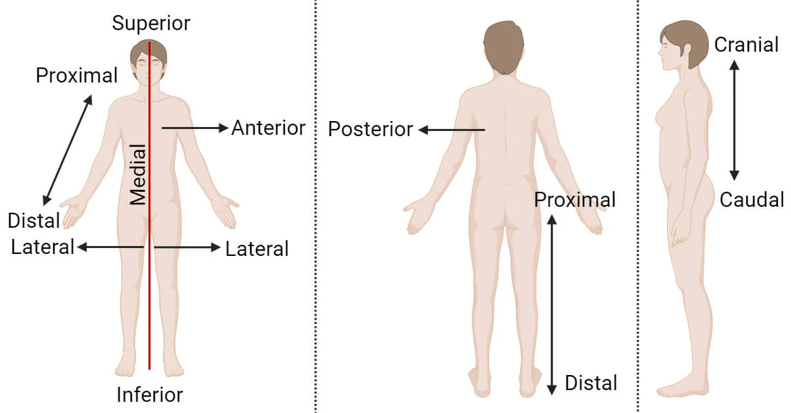
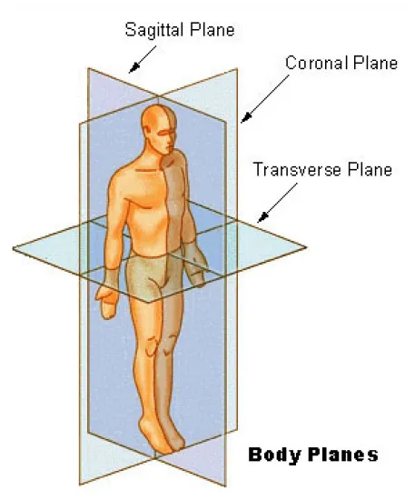

### What is Anatomical Position?

Anatomical position is a standardized posture used as a reference point in studying human anatomy. Head over to this link: [Anatomical Position and Directional Terms](https://www.youtube.com/watch?v=t6-ueqFK1IE)

### Anatomical Directional Terms

1. **Superior:** Refers to a structure that is higher or above another structure. For example, the head is superior to the neck.
2. **Inferior:** Describes a structure that is lower or below another structure. The feet are inferior to the knees.
3. **Medial:** Indicates a position closer to the body’s midline. The heart is medial to the lungs.
4. **Lateral:** Refers to a position farther away from the body’s midline. The ears are located laterally on the head.
5. **Anterior:** At or near the front of the body (front view)
6. **Posterior:** At or near the back of the body (back view)
7. **Midline:** An imaginary vertical line that divides the body equally (right down the middle)
8. **Proximal:** Nearer to the origination of a structure
9. **Distal:** Farther from the origination of a structure

### Anatomical Planes

1. **Sagittal Plane:** This plane divides the body into left and right halves. The midsagittal (or median) plane runs through the body’s midline, creating equal left and right halves.
2. **Coronal Plane:** The frontal plane divides the body into front (anterior) and back (posterior) portions. It’s like a vertical slice that separates the front and back of the body.
3. **Transverse Plane:** This horizontal plane cuts the body into upper (cranial) and lower (caudal) sections. It’s often referred to as the cross-sectional plane.
